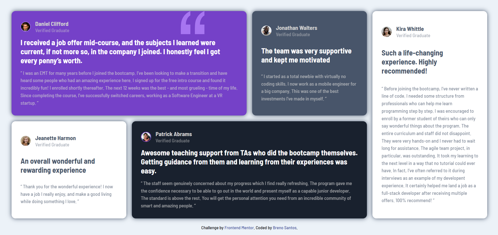

# Frontend Mentor - Testimonials grid section solution

This is a solution to the [Testimonials grid section challenge on Frontend Mentor](https://www.frontendmentor.io/challenges/testimonials-grid-section-Nnw6J7Un7).

## Table of contents

- [Overview](#overview)
  - [The challenge](#the-challenge)
  - [Screenshot](#screenshot)
  - [Links](#links)
- [My process](#my-process)
  - [Built with](#built-with)
  - [What I learned](#what-i-learned)
  - [Continued development](#continued-development)
- [Author](#author)

**Note: Delete this note and update the table of contents based on what sections you keep.**

## Overview

### The challenge

Users should be able to:

- View the optimal layout for the site depending on their device's screen size

### Screenshot

### Links

- Solution URL: [https://github.com/breno-santos95/testimonials-grid-section](https://your-solution-url.com)
- Live Site URL: [https://breno-santos95.github.io/testimonials-grid-section/](https://your-live-site-url.com)

## My process

### Built with

- Semantic HTML5 markup
- CSS custom properties
- Flexbox
- CSS Grid

### What I learned

In this project, I aimed to consolidate my knowledge of grid and flex, as well as concepts like responsiveness and the use of Git/GitHub.

### Continued development

I want to keep refining my application of grid and continue working on the responsiveness of my projects.

## Author

- Website - [https://breno-santos95.github.io/portfolio/](https://www.your-site.com)
- Frontend Mentor - [https://www.frontendmentor.io/profile/breno-santos95](https://www.frontendmentor.io/profile/yourusername)

